<p align="center">
  
</p>

<p align="center">
  
  
  
  
</p>

---

## ⚜️ The Masterpiece

**KRONOS** is an ultra-premium, interactive website dedicated to the art of fine Swiss horology. Combining luxury aesthetics with modern, state-of-the-art web technologies, KRONOS redefines brand presentations by bringing mechanical movements, bespoke customizing, and a VIP boutique experience to life in vanilla HTML5, CSS3, and JavaScript.

> *“Time is not just measured; it is crafted.”*

---

## ✨ Features at a Glance

<table>
  <tr>
    <td width="50%" valign="top">
      <h3>⚙️ Real-time Mechanical Simulation</h3>
      <p>An interactive, mathematical simulation of a clockwork escapement wheel, pallet fork, balance wheel, and mainspring barrel cogs. Adjust mainspring tension in real-time or cycle frequencies (from 2.5Hz vintage to 5.0Hz high-beat caliber) to see mechanical principles in motion.</p>
    </td>
    <td width="50%" valign="top">
      <h3>🎨 Bespoke Watch Customizer</h3>
      <p>Select case metals (Steel, 18K Yellow Gold, Rose Gold, Stealth DLC Titanium), dials, and strap materials in a real-time SVG compositor. Computes dynamic pricing and includes an experimental web-camera Virtual Try-on overlay.</p>
    </td>
  </tr>
  <tr>
    <td width="50%" valign="top">
      <h3>❤️ local Wishlist System</h3>
      <p>Browse catalog collections and add luxury watches to your wishlist with a single click. A slide-in Wishlist drawer handles item management, count updating, and data persistence via browser <code>localStorage</code>.</p>
    </td>
    <td width="50%" valign="top">
      <h3>📅 VIP Boutique Booking</h3>
      <p>Schedule private Geneva, London, or Dubai flagship consultations using an elegant glassmorphic booking interface. Inputs are fully validated with dynamic submit state animations.</p>
    </td>
  </tr>
  <tr>
    <td width="50%" valign="top">
      <h3>🎵 Audio Escape Wheel Synthesizer</h3>
      <p>Features a custom Web Audio API synthesizer that produces ticking sounds representing a physical mechanical escapement release/tick-tock cycle, responding to your interactions.</p>
    </td>
    <td width="50%" valign="top">
      <h3>💎 Boutique Editorial Journal</h3>
      <p>A magazine-style blog system displaying horology stories and editorials, with scaling card previews, category chips, and read time estimates.</p>
    </td>
  </tr>
</table>

---

## ⚡ Technical Highlights

- **WebGL Fluid Distortion Shader**: Hovering over watch images triggers a custom WebGL fragment shader creating liquid ripple wave distortions.
- **Spec Specular Reflections**: Uses device orientation gyroscope tilt data on mobile to shift gold gradient anchors on watch bezels, mimicking physical lighting reflections.
- **Dynamic 3D Letter-Flip Navigation**: Custom letter-splitting loops render smooth 3D letter rotations on navigation hover.
- **Curtain Transitions**: A custom AJAX PJAX router intercepts URL clicks to load page assets asynchronously, matching with entrance/exit transitions.
- **Swiss Time SVG Clock**: A live, real-time SVG clock in the footer with a sweeping second hand synchronized with actual local time.
- **Smooth Cursor Follower**: High-performance, low-latency particle trails drift upwards from the cursor mimicking golden clockwork dust.

---

## 🛠️ Project Structure

```text
├── index.html            # Main landing page, stats counter, testimonials, Insta gallery
├── collections.html      # Watch catalog, filtering, product quick-view modal, wishlist
├── configurator.html     # Bespoke SVG watch builder, pricing, AR Try-on webcam stream
├── simulation.html       # Mechanical physics escapement simulation, frequency toggler
├── heritage.html         # Brand timeline, craftsmanship section
├── boutique.html         # Private VIP appointment scheduler and boutique locations
├── journal.html          # Editorial magazine and articles grid
├── script.js             # Consolidated JavaScript engine (PJAX, shaders, physics cogs)
├── style.css             # Unified CSS design tokens, animations, and typography system
└── images/               # High-fidelity watch renders, lifestyle photography, and SVG graphics
```

---

## 🚀 Getting Started

Since KRONOS is written in pure vanilla web technologies, there are no compilers, bundlers, or packages to install. 

1. **Clone the repository:**
   ```bash
   git clone https://github.com/yourusername/kronos.git
   cd kronos
   ```

2. **Run a local development server:**
   Because the site utilizes WebGL shaders and asynchronous PJAX page routing, it must be hosted on a local web server (loading directly via `file://` protocol will cause browser security CORS blocks on scripts/assets).

   * **Python (Recommended):**
     ```bash
     python -m http.server 8000
     ```
   * **Node.js (Alternative):**
     ```bash
     npx http-server .
     ```
   * **VS Code (Alternative):**
     Right-click `index.html` and click **"Open with Live Server"**.

3. **Explore:**
   Open `http://localhost:8000` in your web browser.

---

## 🎨 Luxury Design Tokens

KRONOS defines a cohesive visual identity inspired by Swiss haute horlogerie:
* **Background Primary**: `#0a0a0a` (Vantablack inspired deep void)
* **Accent Gold**: `#c9a96e` (Refined brushed champagne gold)
* **Text Muted**: `#888888` (Titanium grey)
* **Primary Fonts**: `Outfit` (Modern structural sans) & `Cinzel` / `Playfair` (Classical serif)

---

<p align="center">
  <sub>Crafted with passion for horological art. © 2026 KRONOS. All Rights Reserved.</sub>
</p>
